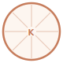

<p align="center">
  
</p>

<h1 align="center">kobol-site</h1>

<p align="center">
  The marketing/landing site for <a href="https://github.com/kobol-lang/kobol"><b>Kobol</b></a> —
  a modern, COBOL-inspired language for the JVM.<br>
  Live at <a href="https://kobol-lang.org/">kobol-lang.org</a>.
</p>

---

## Tech stack

| | |
|---|---|
| Framework | React 19 (single-page, no router) |
| Build | Vite 8 |
| Styling | Tailwind CSS v4 (`@theme` tokens — the clay/warm palette) |
| Lint | ESLint 10 + typescript-eslint |
| Hosting | GitHub Pages (custom domain) |

## Develop

```bash
npm install
npm run dev        # local dev server with HMR
npm run lint       # eslint
```

## Build

```bash
npm run build      # type-checks (tsc -b), then emits minified output to docs/
npm run preview    # preview the production build locally
```

The build is written to **`docs/`** (set in [vite.config.ts](vite.config.ts)) so GitHub Pages can
serve it. `base: './'` keeps asset paths relative. Commit `docs/` after each rebuild.

> Deployment, DNS, SEO, and analytics setup are documented in `SETUP.md` (local, gitignored).

## Structure

- `src/App.tsx` — the entire single-page site (Hero, Why, Principles, Install, Syntax tabs,
  Features, Specs, Footer).
- `src/index.css` — Tailwind import + clay/warm theme tokens (`@theme`).
- `public/` — static assets + discoverability files copied verbatim into `docs/`.

All code samples mirror the canonical examples in the
[Kobol repo](https://github.com/kobol-lang/kobol/tree/main/examples) and the
[language specification](https://github.com/kobol-lang/kobol/blob/main/docs/LANGUAGE_SPEC.md).
